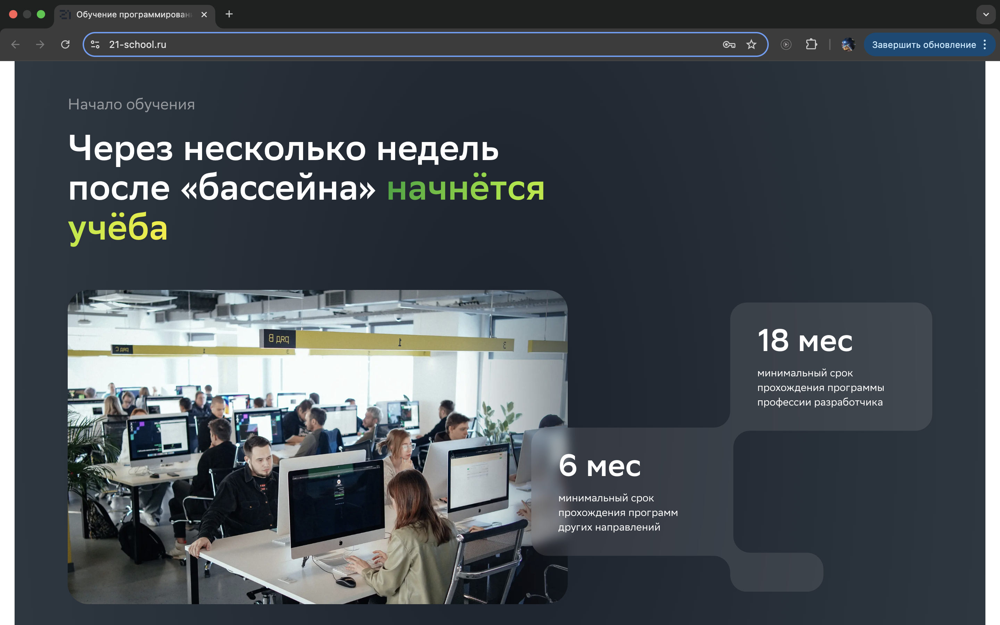
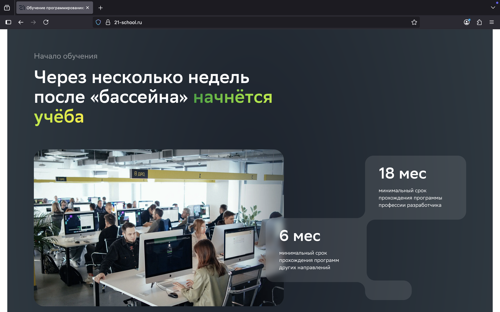
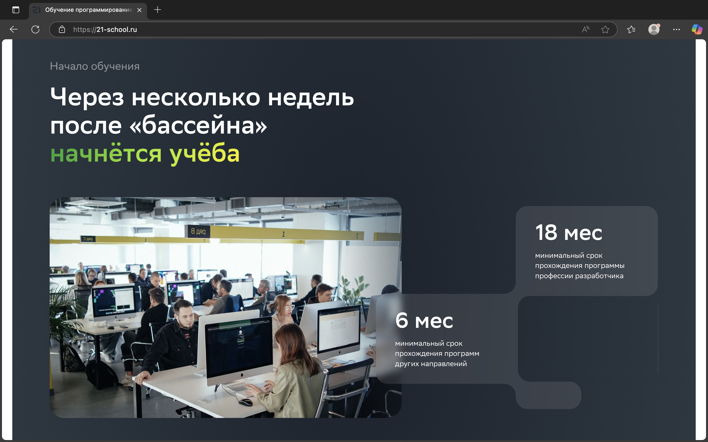
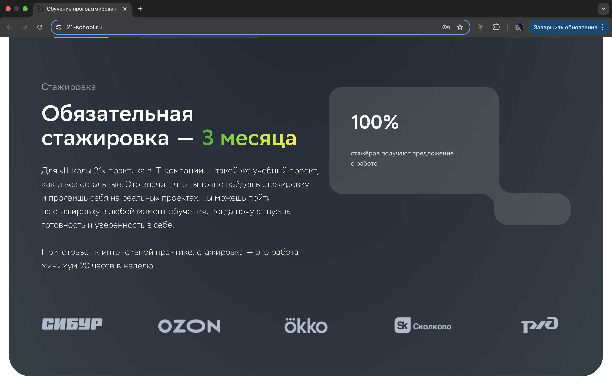
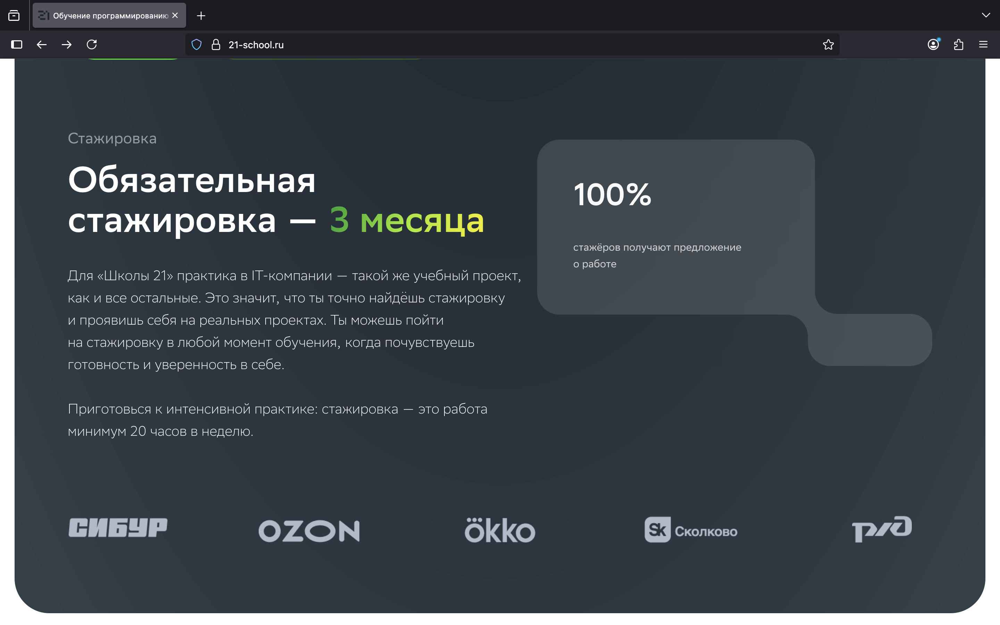
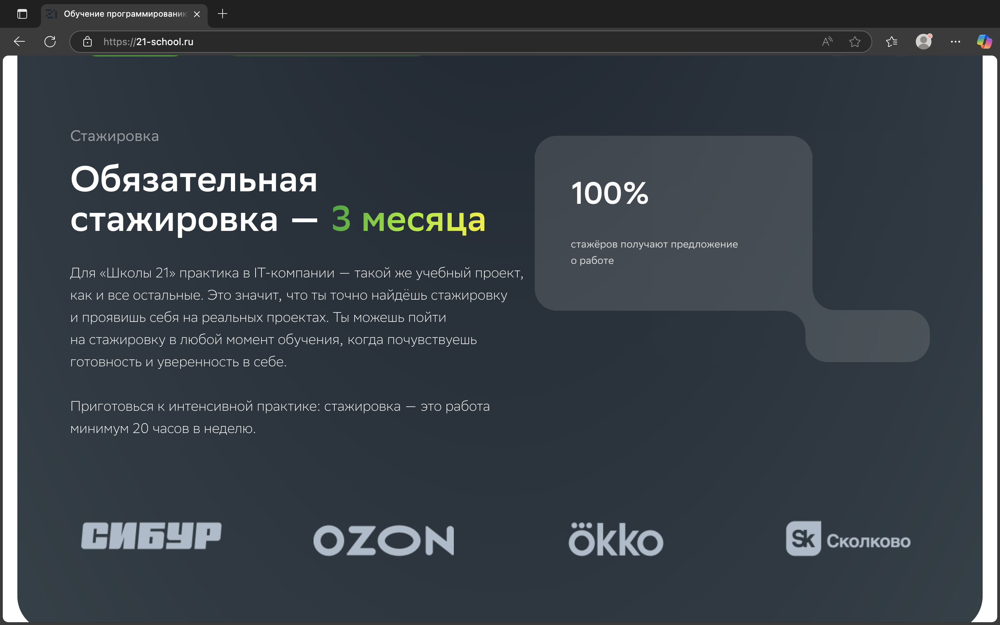

## Task 3. Движки браузеров

* **Перейди на сайт «Школы 21»: https://21-school.ru/.**

* **Протестируй сайт на отображение интерфейса в разных браузерах (Chrome, Firefox, Edge).**

* **Сравни результаты и выпиши отличия в отображении элементов.**

## Task 3. Решение:

Версии браузеров:\
Google Chrome - 136.0.7103.114.\
 Edge - 138.0.3351.109.\
 Firefox - 141.0

**1. В браузерах Chrome и Edge в отличии от Firefox в начале страницы надпись "Бесплатная школа цифровых технологий" находится немного выше**

**2. В браузерах Chrome и Edge в отличии от Firefox в начале страницы полоса разделяющая слова "От" и "Сбера" находится немного ниже**

**3. В браузерах Chrome и Firefox в отличии от Edge в блоке "Начало обучения" в заголовке "Через несколько недель после "бассейна" начнётся учёба" -> фраза "начнётся учёба" переноситься на новую строку частями, в Edge же эта фраза переносится на новую строку целиком**

**4. В браузерах Chrome и Firefox в отличии от Edge в блоке "Стажировка" иконки компаний партнеров меньше**

#### Скриншоты:

**1./2.**\
Chrome

Edge

Firefox

**3.**\
Chrome

Firefox

Edge

**4.**\
Chrome

Firefox

Edge

