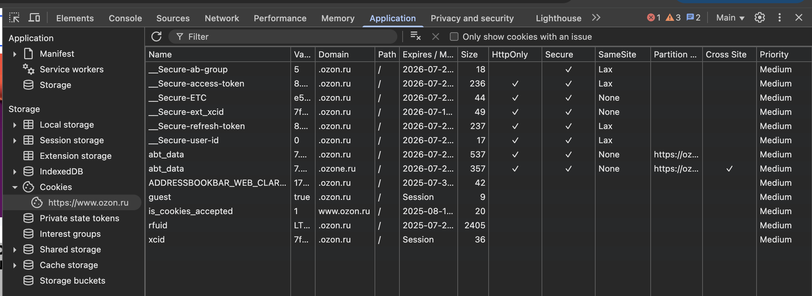

## Task 5. Cookies

* **Перейди на любой сайт, который использует Cookies (обычно в 100% случаев это интернет-магазины).**

* **Открой Chrome DevTools и во вкладке «Application» найди сведения о Cookies. Посмотри и запиши, какие данные сайт записал о тебе, и обрати внимание на флаги: Secure, HttpOnly, SameSite.**

## Task 5. Решение:

**Сайт: https://www.ozon.ru/**  

**Скриншот вывода сохраненных сайтом cookies файлов:**

На скриншоте видно, что сайт собрал 13 файлов cookies

**Описать какие точно данные собрал сайт не получится, так как нет доступа к коду сервера, но можно предположить из названия cookies:**

1.  **__Secure-access-token** – токен доступа

2.  **__Secure-refresh-token** – токен для обновления сессии

3.  **__Secure-user-id** – идентификатор пользователя

4.  **guest** – метка гостевого режима

5.  **xcid** – временный ID сессии

6.  **is_cookies_accepted** – флаг согласия на использование cookies

**Не получится определить без доступа к коду сервера:**

7.  **ADDRESSBOOKBAR_WEB_CLARIFICATION** - none

8.  **__Secure-ETC** - none

9.  **__Secure-ab-group** - none 

10.  **abt_data** - none 

11.  **__Secure-ext_xcid** - none 

12.  **rfuid** - none

**За что отвечает каждый из столбцов данной таблицы:**

* **Name** - имя файла

* **Value** - значение файла

* **Domain** - домен сайт который сохранил файл куки

* **Expires** - срок годности файла куки ("Session" - файл храниться до конца сессии)

* **Size** - размер файла куки 

* **HttpOnly** - файл скрыт от JavaScript, прочитать его не получится (если стоит галочка)

* **Secure** - файл куки передаётся только по HTTPS (зашифрованное соединение) (если стоит галочка)

* **SameSite** - правила пропуска для куки файлов

* **Patrition Key Site** - определяет, к какой изолированной части сайта привязаны куки

* **Cross Site** - принадлежность к группе сайтов

* **Priority** - приоритет хранения 