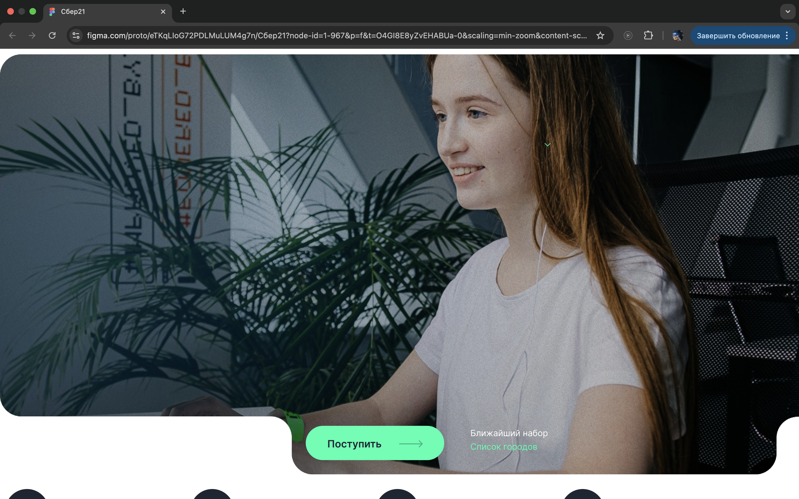
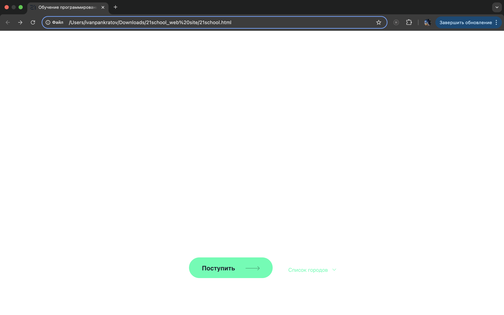

## Task 6. Тестирование UI веб-сайта

* Открыть локально веб-сайт
* Перейти на страницу макета веб-сайта
* Сравнить макет с реализованным сайтом (макет считается эталоном)
* Все найденные отличия завести в виде багрепортов

## Task 6. Решение:

### Отчёт по тестированию UI веб-сайта:
### Общее количество баг-репортов: 16 (только critical и major-дефекты).

**Причины исключения второстепенных несоответствий:**

* Различия в переносе строк наблюдаются во всех текстовых блоках

* Системные отклонения в отступах (между элементами, изображениями, видео) от эталонных значений

* Несоответствие цветовой палитры (фон, текст) требованиям макета

* Макет содержит скрытые элементы (текст/иконки в слоях)

**Шаги воспроизведения для всех баг-репортов:**

1. Открыть локально веб-сайт(ссылка для скачивания: https://disk.360.yandex.ru/d/6xkKNnkKHp8MFA)

2. Перейти на страницу макета веб-сайта(ссылка: https://www.figma.com/design/eTKqLIoG72PDLMuLUM4g7n/%D0%A1%D0%B1%D0%B5%D1%8021?node-id=0-1&p=f&t=Ay81dOq3y7cXnGHn-0)

3. Сравнить макет с реализованным сайтом

### Баг-репорт 1:

**Заголовок:** Фоновое изображение

**Описание** На сайте отсутствует фоновое изображение в шапке страницы

**Продукт:** Локальный веб-сайт и макет веб-сайта

**Критичность:** Critical

**Приоритет:** High

**Статус:** New

**Автор:** karoncre

**Назначен на:** Команда разработчиков/дизайнеров

**Окружение:** macOS Sequoia 15.5, Google Chrome Версия: 136.0.7103.114

**Фактический результат:** Фоновое изображение в шапке страницы отсутствует

**Ожидаемый результат:** Фоновое изображение отображается в соответствии с макетом

**Скриншоты дефекта:**

* Макет 

* Сайт

### Баг-репорт 2:

**Заголовок:** Текст и иконки

**Описание** Отсутвует текст и иконки в шапке страницы в макете и на сайте, хотя в слоях текст и иконки присутствуют

**Продукт:** Локальный веб-сайт и макет веб-сайта

**Критичность:** Critical

**Приоритет:** High

**Статус:** New

**Автор:** karoncre

**Назначен на:** Команда разработчиков/дизайнеров

**Окружение:** macOS Sequoia 15.5, Google Chrome Версия: 136.0.7103.114

**Фактический результат:** Текст и иконки в шапке страницы отсутсвует как на макете, так и на сайте, хотя в слоях присутствуют

**Ожидаемый результат:** Весь текст и все иконки отображаются корректно

**Скриншоты дефекта:**

* Макет 

* Сайт

### Баг-репорт 3:

**Заголовок:** Иконки

**Описание** На сайте отсутствуют иконки под шапкой страницы 

**Продукт:** Локальный веб-сайт и макет веб-сайта

**Критичность:** Major

**Приоритет:** High

**Статус:** New

**Автор:** karoncre

**Назначен на:** Команда разработчиков/дизайнеров

**Окружение:** macOS Sequoia 15.5, Google Chrome Версия: 136.0.7103.114

**Фактический результат:** Не отображаются иконки под шапкой страницы

**Ожидаемый результат:** Отображение иконок корректно и соответствует макету

**Скриншоты дефекта:**

* Макет 

* Сайт

### Баг-репорт 4:

**Заголовок:** Баннер

**Описание** На сайте в блоке "Программа обучения" отсутствуют фигурные закругления баннеров

**Продукт:** Локальный веб-сайт и макет веб-сайта

**Критичность:** Major

**Приоритет:** High

**Статус:** New

**Автор:** karoncre

**Назначен на:** Команда разработчиков/дизайнеров

**Окружение:** macOS Sequoia 15.5, Google Chrome Версия: 136.0.7103.114

**Фактический результат:** Баннеры отображаются без фигурных закруглений или не корректно

**Ожидаемый результат:** Баннеры отображаются в соответствии с макетом

**Скриншоты дефекта:**

* Макет 

* Сайт

### Баг-репорт 5:

**Заголовок:** Изображение

**Описание** На сайте не прогружается изображение в блоке "В Школу 21 может поступить любой желающий"

**Продукт:** локальный веб-сайт и макет веб-сайта

**Критичность:** Critical

**Приоритет:** High

**Статус:** New

**Автор:** karoncre

**Назначен на:** Команда разработчиков/дизайнеров

**Окружение:** macOS Sequoia 15.5, Google Chrome Версия: 136.0.7103.114

**Фактический результат:** В блоке "В Школу 21 может поступить любой желающий" не прогружается изображение

**Ожидаемый результат:** Изображение отображается в соответсвии с макетом

**Скриншоты дефекта:**

* Макет 

* Сайт

### Баг-репорт 6:

**Заголовок:** Иконки

**Описание** На сайте в блоке "В Школу 21 может поступить любой желающий" осутствуют иконки

**Продукт:** локальный веб-сайт и макет веб-сайта

**Критичность:** Major

**Приоритет:** High

**Статус:** New

**Автор:** karoncre

**Назначен на:** Команда разработчиков/дизайнеров

**Окружение:** macOS Sequoia 15.5, Google Chrome Версия: 136.0.7103.114

**Фактический результат:** Не отображаются иконки в блоке "В Школу 21 может поступить любой желающий"

**Ожидаемый результат:** Отображение иконок корректно и соответствует макету

**Скриншоты дефекта:**

* Макет 

* Сайт

### Баг-репорт 7:

**Заголовок:** Баннер

**Описание** На сайте в блоке "Этапы поступления" отсутствуют фигурные закругления банееров

**Продукт:** локальный веб-сайт и макет веб-сайта

**Критичность:** Major

**Приоритет:** High

**Статус:** New

**Автор:** karoncre

**Назначен на:** Команда разработчиков/дизайнеров

**Окружение:** macOS Sequoia 15.5, Google Chrome Версия: 136.0.7103.114

**Фактический результат:** Отсутствуют фигурные закругления банееров

**Ожидаемый результат:** Все банееры отображаются в соответсвии с макетом

**Скриншоты дефекта:**

* Макет 

* Сайт

### Баг-репорт 8:

**Заголовок:** Изображение

**Описание** На сайте не прогружаеся изображение в блоке "Начало обучения"

**Продукт:** локальный веб-сайт и макет веб-сайта

**Критичность:** Critical

**Приоритет:** High

**Статус:** New

**Автор:** karoncre

**Назначен на:** Команда разработчиков/дизайнеров

**Окружение:** macOS Sequoia 15.5, Google Chrome Версия: 136.0.7103.114

**Фактический результат:** В блоке "Начало обучения" не прогружается изображение

**Ожидаемый результат:** Озображение отображается в соответсвии с макетом

**Скриншоты дефекта:**

* Макет 

* Сайт

### Баг-репорт 9:

**Заголовок:** Баннер

**Описание** На сайте в блоке "Начало обучения" отсутствуют фигурные закругления баннера

**Продукт:** локальный веб-сайт и макет веб-сайта

**Критичность:** Major

**Приоритет:** High

**Статус:** New

**Автор:** karoncre

**Назначен на:** Команда разработчиков/дизайнеров

**Окружение:** macOS Sequoia 15.5, Google Chrome Версия: 136.0.7103.114

**Фактический результат:** Отсутствуют фигурные закругления баннера

**Ожидаемый результат:** Все баннеры отображаются в соответсвии с макетом

**Скриншоты дефекта:**

* Макет 

* Сайт

### Баг-репорт 10:

**Заголовок:** Видео

**Описание** В макете в блоке "Участники и выпускники о Школе 21" отсутсвует место для видео, в то время как на сайте место под видео есть

**Продукт:** локальный веб-сайт и макет веб-сайта

**Критичность:** Critical

**Приоритет:** High

**Статус:** New

**Автор:** karoncre

**Назначен на:** Команда разработчиков/дизайнеров

**Окружение:** macOS Sequoia 15.5, Google Chrome Версия: 136.0.7103.114

**Фактический результат:** В макете нет места под видео в блоке "Участники и выпускники о Школе 21", хотя на сайте видео присутсвуют

**Ожидаемый результат:** В макете и на сайте отображение видео одинково

**Скриншоты дефекта:**

* Макет 

* Сайт

### Баг-репорт 11:

**Заголовок:** Изображение

**Описание** На сайте не прогружаеся изображение в блоке "Методология"

**Продукт:** локальный веб-сайт и макет веб-сайта

**Критичность:** Critical

**Приоритет:** High

**Статус:** New

**Автор:** karoncre

**Назначен на:** Команда разработчиков/дизайнеров

**Окружение:** macOS Sequoia 15.5, Google Chrome Версия: 136.0.7103.114

**Фактический результат:** В блоке "Методология" не прогружается изображение

**Ожидаемый результат:** Изображение отображается в соответсвии с макетом

**Скриншоты дефекта:**

* Макет 

* Сайт

### Баг-репорт 12:

**Заголовок:** Кнопка

**Описание** В макете в блоке "Методология" нет кнопки "Подробнее о методике", хотя на сайте она присутствуют

**Продукт:** локальный веб-сайт и макет веб-сайта

**Критичность:** Critical

**Приоритет:** High

**Статус:** New

**Автор:** karoncre

**Назначен на:** Команда разработчиков/дизайнеров

**Окружение:** macOS Sequoia 15.5, Google Chrome Версия: 136.0.7103.114

**Фактический результат:** На сайте в блоке "Методология" есть кнопка "Подробнее о методике", в макете нет, хотя он считается эталоном

**Ожидаемый результат:** На сайте и в макете кнопка присутствует

**Скриншоты дефекта:**

* Макет 

* Сайт

### Баг-репорт 13:

**Заголовок:** Кампус

**Описание** На сайте отсутствует блок "Кампусы" вместе со всем содержимым

**Продукт:** локальный веб-сайт и макет веб-сайта

**Критичность:** Critical

**Приоритет:** High

**Статус:** New

**Автор:** karoncre

**Назначен на:** Команда разработчиков/дизайнеров

**Окружение:** macOS Sequoia 15.5, Google Chrome Версия: 136.0.7103.114

**Фактический результат:** При открытии сайта, отсутствует блок "Кампусы" и все содержимое

**Ожидаемый результат:** Блок отображается корректно

**Скриншоты дефекта:**

* Макет 

* Сайт

### Баг-репорт 14:

**Заголовок:** Баннер

**Описание** На сайте в блоке "Заявка на поступление" отсутствует фигурное закругление баннера

**Продукт:** локальный веб-сайт и макет веб-сайта

**Критичность:** Major

**Приоритет:** High

**Статус:** New

**Автор:** karoncre

**Назначен на:** Команда разработчиков/дизайнеров

**Окружение:** macOS Sequoia 15.5, Google Chrome Версия: 136.0.7103.114

**Фактический результат:** Отсутствует фигурное закругление баннера

**Ожидаемый результат:** Баннер отображается в соответсвии с макетом

**Скриншоты дефекта:**

* Макет 

* Сайт

### Баг-репорт 15:

**Заголовок:** Кнопки

**Описание** В макете в блоке "Ответы на вопросы" нет кнопок "Поступление" и "Обучение", на сайте они присутствуют

**Продукт:** локальный веб-сайт и макет веб-сайта

**Критичность:** Critical

**Приоритет:** High

**Статус:** New

**Автор:** karoncre

**Назначен на:** Команда разработчиков/дизайнеров

**Окружение:** macOS Sequoia 15.5, Google Chrome Версия: 136.0.7103.114

**Фактический результат:** На сайте в блоке "Ответы на вопросы" есть кнопки "Поступление" и "Обучение", в макете нет, хотя он считается эталоном

**Ожидаемый результат:** На сайте и в макете кнопки присутствует

**Скриншоты дефекта:**

* Макет 

* Сайт

### Баг-репорт 16:

**Заголовок:** Баннеры

**Описание** На сайте в блоке "О школе/Поступающим/Партнерам" отсутствует фигурное закругление баннера

**Продукт:** локальный веб-сайт и макет веб-сайта

**Критичность:** Major

**Приоритет:** High

**Статус:** New

**Автор:** karoncre

**Назначен на:** Команда разработчиков/дизайнеров

**Окружение:** macOS Sequoia 15.5, Google Chrome Версия: 136.0.7103.114

**Фактический результат:** Отсутствует фигурное закругление баннера

**Ожидаемый результат:** Баннер отображается в соответсвии с макетом

**Скриншоты дефекта:**

* Макет 

* Сайт
