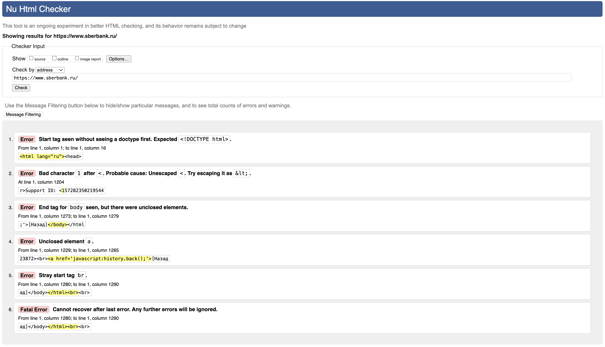

## Task 7. Валидация HTML

* **Перейди на сайт валидатора W3.org.**

* **Провалидируй любой сайт.**

* **Выпиши ошибки, которые выдал валидатор по результату проверки.**

## Task 7. Решение:

**Проверка сайта:** https://www.sberbank.ru/\
**Сайт валидатор:** https://validator.w3.org/

**Скриншот валидации:**

**Ошибки:**

1. От строки 1 до строки 16

 * **Ошибка(Критично):** начальный тег обнаружен без предварительного указания типа документа. Ожидается `<!DOCTYPE html>`.

    `<html lang="ru"><head>`

2. В строке 1204

* **Ошибка(Критично):** Недопустимый символ `1` после `<`. Вероятная причина: Неэкранированный `<`. Попробуйте экранировать его как `&lt;`.

    `r>Support ID: <157282350219544`

3. От строки 1273 до строки 1279

* Ошибка: Конечный тег для `body` виден, но имеются незакрытые элементы.

    `;'>[Назад]</body></html`

4. От строки 1229 до строки 1265

* **Ошибка(Критично):** Незакрытый элемент `a`.

    `23872> <a href='javascript:history.back();'>[Назад`

5. От строки 1280 до строки 1290

* **Ошибка(Критично):** ошибочный начальный тег `br`.

    `ад]</body></html>  `

6. От строки 1280 до строки 1290

* **Фатальная ошибка(Критично)**: Невозможно восстановить после последней ошибки. Любые последующие ошибки будут игнорироваться.

    `ад]</body></html>  `

### Вывод:

**Сайт содержит 5 критических ошибки и 1 предупреждение, требующие исправления. Основные проблемы:**

* Отсутствие DOCTYPE

* Неэкранированные символы в динамическом контенте

* Нарушенная структура HTML

* Последняя ошибка сделала невозможным дальнейший анализ валидатора