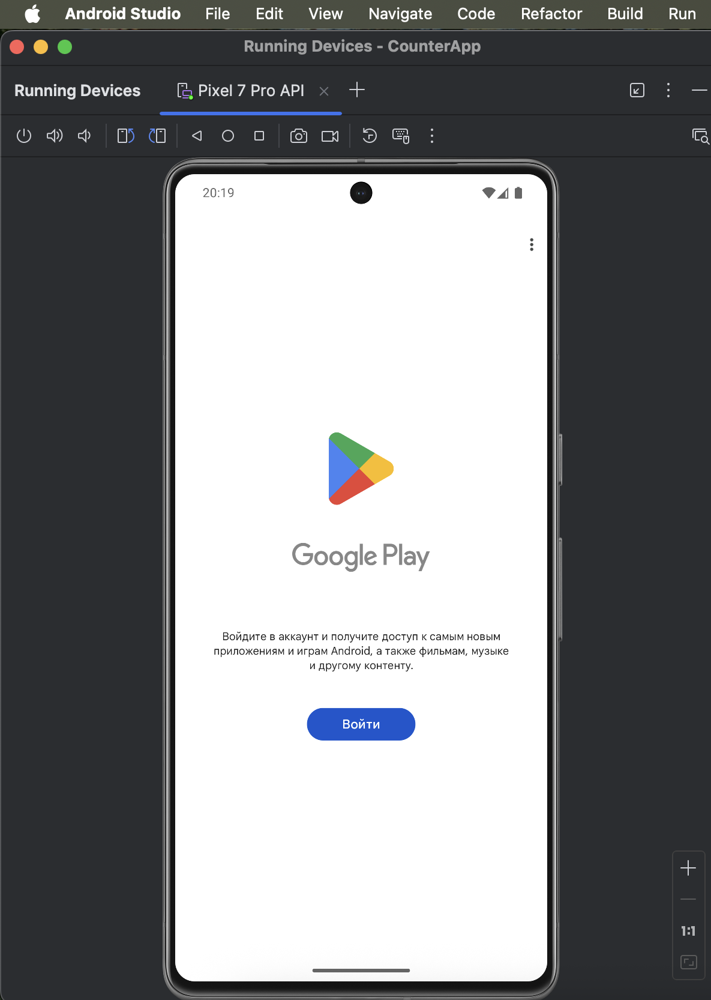
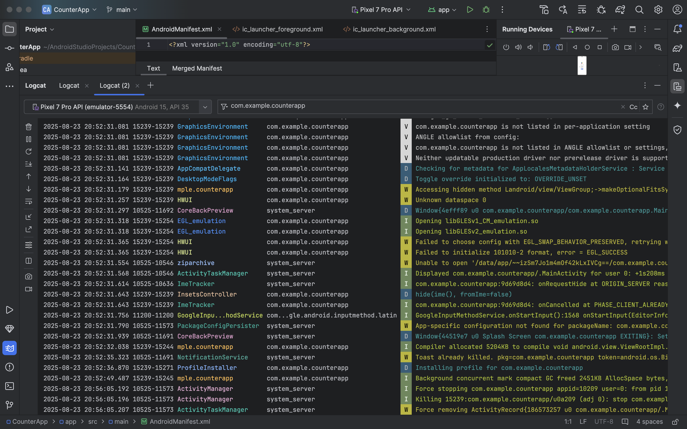
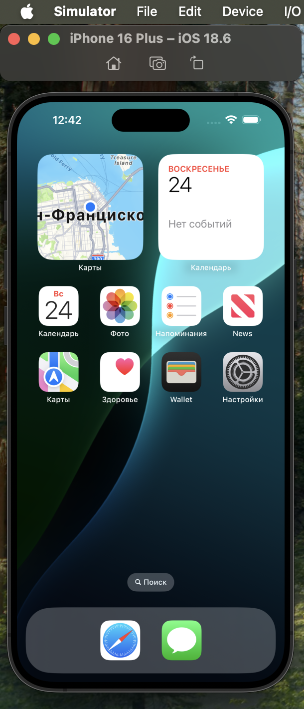

### Задание 3. Работа с Android Studio

1. Установи Android Studio (интернет-гайды в помощь).
1. Создай эмулятор с поддержкой Play Market в Android Studio (остальная конфигурация любая).
1. Изучи процесс включения режима разработчика для своего мобильного телефона (для Android). Если нет физического устройства на Android — выполни на эмуляторе.
1. Изучи функцию Logcat в Android Studio и попрактикуйся в снятии логов.
1. По гайдам из интернета напиши пошаговую инструкцию по созданию эмулятора в Xcode.

### Задание 3. Решение:

2. 
**Создан эмулятор телефона Pixel 7 Pro с поддержкой Google PLay**

3. 

**Для того чтобы включить режим разработчика на эмуляторе данной модели телефона (Pixel 7 Pro) нужно выполнить следующие действия:**
* Зайти в настройки телефона
* Перейти в раздел "Об эмулированном устройстве"
* Нажать несколько раз подряд на "Номер сборки", пока не появится сообщение о том, что вы стали разработчиком

4. 

**В процессе снятия логов критических ошибок в работе приложения com.example.counterapp не обнаружено. Лог зафиксировал стандартный процесс его установки, запуска и отображения на экране за 1.2 секунды (Приложение написали сами для теста логов)**

5. 

**Шаги по установке и добавлению симуляторов(Xcode):**
* Скачать и установить Xcode из App Store 
* Открыть Xcode на Mac 
* Перед запуском проекта Xcode попросит установить среду разработки (симултор) или предложит разрабатывать проекты для этого Mac (В случае чего дополнительную ОС можно будет установить позже)
* В строке меню перейти в "Окно" > "Устройства и симуляторы" (Window > Divaces and Simulators)
* В верхней части открывшейся боковой панели выбрать вкладку "Симуляторы" (Simulators)
* Нажать кнопку " + ", расположенную в левом нижнем углу 
* Выбрать из списка нужную версию операционной системы (iOS, iPadOS и т.д.) и тип устройства для загрузки и использования
* Нажать кнопку "Создать" (Create)
* В верхней части нового проекта нужно выбрать на каком устройстве мы бы хотели запустить программу: выбрать нужный симулятор
* Запустить проект нажатием кнопки пуск (кнопка в виде треугольника) в верхней левочй части приложения (Cmd+R)

P.S. Последующие запуски симулятора можно осуществлять не через запуск Xcode, а через запуск иконки симулятора (она появится на рабочем столе после первого запуска симулятора)

**Успешный запуск симулятора**

