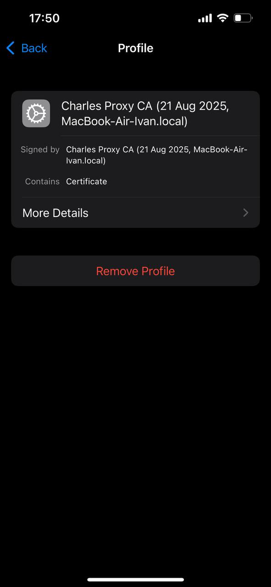
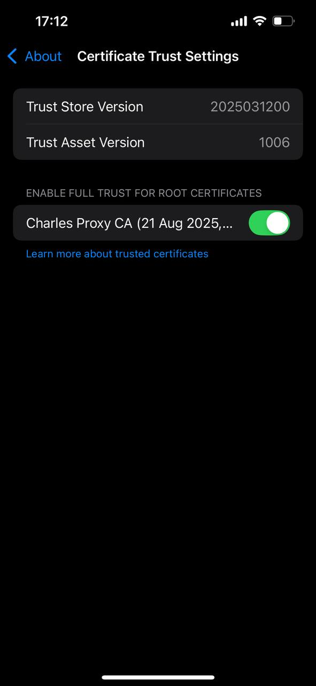

### Задание 5. Charles Proxy

1. Установи приложение Charles Proxy и настрой окружение (сертификат на ПК и  мобильный телефон).
1. Изучи и кратко опиши назначение следующих функциональностей сниффера:
   1. Фильтрация запросов;
   1. Работа с логами;
   1. Работа с зашифрованным трафиком;
   1. Map remote;
   1. Breakpoint;
   1. Rewrite;
   1. Throttling.

### Задание 5. Решение:

**Charles Proxy** — это сниффер (sniffer – перехватчик) трафика, инструмент для анализа трафика, который позволяет отслеживать, записывать и анализировать сетевые запросы между устройствами и интернетом

1. 
**Фильтрация запросов**

Это поле в нижней части логов окна Charles, куда можно ввести часть URL или ключевое слово. Это нужно чтобы в огромной массе всех сетевых запросов найти именно те, которые интересуют

2. 
**Работа с логами**

Это основное окно Charles, где в реальном времени отображается весь сетевой трафик (запросы и ответы) в хронологическом порядке. Это главный «сниффер». Здесь можно увидеть: куда, когда и с какими данными обращается приложение. Можно изучать структуру запросов, заголовки, коды ответов

3. 
**Работа с зашифрованным трафиком**

Это функция для расшифровки HTTPS-трафика. Без этого можно было бы увидеть только непонятный шифр вместо полезных данных JSON/XML. Charles подменяет сертификаты сайтов на свой собственный, что позволяет ему «подглядеть» в зашифрованные данные

4. 
**Map Remote**

Map Remote позволяет перенаправить трафик с одного хоста на другой по настраиваемым правилам

5. 
**Breakpoint**

Breakpoint — дает возможность приостановить выполнение запроса или ответа на определенном этапе и проанализировать содержимое для того, чтобы можно было внести необходимые изменения и проверить как приложение или сервер отреагируют на внесённые нами изменения

Breakpoint можно использовать, чтобы изменить URL запроса на сервер, заменить один заголовок на другой, изменить содержимое тела запроса или ответа или добавить новый параметр в URL запроса

6. 
**Rewrite**

Функция Rewrite по смыслу похожа на Breakpoint за исключением того, что Rewrite позволяет изменять и перезаписывать запросы и ответы перед их отправкой и получением соответственно, а не ВО ВРЕМЯ, как Breakpoint

7. 
**Throttling**

Throttling создает имитация медленного и нестабильного интернет-соединения. Это нужно чтобы проверить ка приложение ведет себя в условиях плохой сети

**Как выглядит сертификат на телефоне после настройки окружения Charles на телефоне и ПК:**

